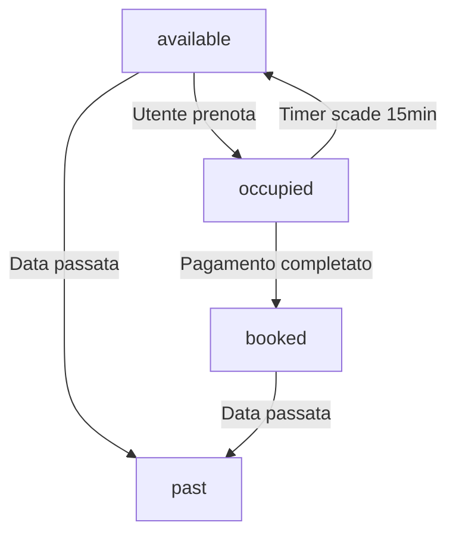

# 🎯 Sistema di Gestione Slot - Stati e Colorazione

## 📋 Panoramica

Documentazione completa del sistema di gestione degli slot di prenotazione, con focus sulla gestione degli stati (disponibili, occupati, passati, prenotati) e sul sistema di colorazione dinamica dei bottoni.

## 🎨 Sistema di Stati degli Slot

### Stati Possibili

| Stato | Colore | Cliccabile | Descrizione | Durata |
|-------|--------|------------|-------------|---------|
| `available` | 🟢 Verde | ✅ Sì | Slot disponibile per prenotazione | Permanente |
| `occupied` | 🟠 Arancione | ❌ No | Slot in attesa di pagamento | 15 minuti |
| `booked` | 🔴 Rosso | ❌ No | Slot prenotato e confermato | Permanente |
| `past` | ⚫ Grigio | ❌ No | Slot nel passato | Permanente |

## 🔄 Flusso di Transizione Stati



## 🎨 Sistema di Colorazione CSS

### 1. **Slot Disponibili (Verde)**
```css
.slot-available {
    background: linear-gradient(135deg, #10b981 0%, #059669 100%);
    color: white;
    border: 2px solid #10b981;
    cursor: pointer;
}

.slot-available:hover {
    background: linear-gradient(135deg, #059669 0%, #047857 100%);
    box-shadow: 0 4px 12px rgba(16, 185, 129, 0.3);
}
```

### 2. **Slot Occupati (Arancione)**
```css
.slot-occupied {
    background: linear-gradient(135deg, #f59e0b 0%, #d97706 100%);
    color: white;
    border: 2px solid #f59e0b;
    cursor: not-allowed;
    opacity: 0.8;
}

.slot-occupied:hover {
    background: linear-gradient(135deg, #d97706 0%, #b45309 100%);
    box-shadow: 0 4px 12px rgba(245, 158, 11, 0.3);
}
```

### 3. **Slot Prenotati (Rosso)**
```css
.slot-booked {
    background: linear-gradient(135deg, #ef4444 0%, #dc2626 100%);
    color: white;
    border: 2px solid #ef4444;
    cursor: not-allowed;
    opacity: 0.9;
}

.slot-booked:hover {
    background: linear-gradient(135deg, #dc2626 0%, #b91c1c 100%);
    box-shadow: 0 4px 12px rgba(239, 68, 68, 0.3);
}
```

### 4. **Slot Passati (Grigio)**
```css
.slot-past {
    background: linear-gradient(135deg, #6b7280 0%, #4b5563 100%);
    color: #d1d5db;
    border: 2px solid #6b7280;
    cursor: not-allowed;
    opacity: 0.6;
}

.slot-past:hover {
    background: linear-gradient(135deg, #4b5563 0%, #374151 100%);
    box-shadow: 0 4px 12px rgba(107, 114, 128, 0.3);
}
```

## 🔧 Logica di Gestione Stati

### 1. **Rilevamento Slot Passati**
```javascript
function isPastSlot(orario, data) {
    const now = new Date();
    const slotDateTime = new Date(`${data}T${orario}:00`);
    
    return slotDateTime < now;
}
```

### 2. **Rilevamento Slot Occupati**
```javascript
function isOccupiedSlot(orario, prenotazioni) {
    return prenotazioni.some(p => {
        const inizio = new Date(p.data_inizio);
        const fine = new Date(p.data_fine);
        const slotTime = new Date(`${p.data_inizio.split('T')[0]}T${orario}:00`);
        
        return slotTime >= inizio && slotTime < fine && p.stato === 'in attesa';
    });
}
```

### 3. **Rilevamento Slot Prenotati**
```javascript
function isBookedSlot(orario, prenotazioni) {
    return prenotazioni.some(p => {
        const inizio = new Date(p.data_inizio);
        const fine = new Date(p.data_fine);
        const slotTime = new Date(`${p.data_inizio.split('T')[0]}T${orario}:00`);
        
        return slotTime >= inizio && slotTime < fine && p.stato === 'confermata';
    });
}
```

## 🎯 Sistema di Aggiornamento UI

### 1. **Aggiornamento Dinamico Colori**
```javascript
function updateSlotButton(slotButton, status, extraData = {}) {
    // Rimuovi tutte le classi di stato precedenti
    slotButton.classList.remove('slot-available', 'slot-occupied', 'slot-booked', 'slot-past');
    
    // Aggiungi nuova classe di stato
    slotButton.classList.add(`slot-${status}`);
    
    // Aggiorna attributi
    slotButton.setAttribute('data-status', status);
    
    // Aggiorna testo e tooltip
    switch (status) {
        case 'available':
            slotButton.title = 'Slot disponibile';
            slotButton.disabled = false;
            break;
        case 'occupied':
            slotButton.title = `Slot occupato - scadenza in ${extraData.minutesRemaining} minuti`;
            slotButton.disabled = true;
            break;
        case 'booked':
            slotButton.title = 'Slot prenotato';
            slotButton.disabled = true;
            break;
        case 'past':
            slotButton.title = 'Slot nel passato';
            slotButton.disabled = true;
            break;
    }
}
```

### 2. **Aggiornamento Real-Time**
```javascript
// Aggiorna tutti gli slot quando arriva notifica SSE
function updateAllSlotsStatus(slotsStatus) {
    slotsStatus.forEach(slot => {
        const slotButton = document.querySelector(`[data-orario="${slot.orario}"]`);
        if (slotButton) {
            updateSlotButton(slotButton, slot.status, {
                title: slot.title,
                minutesRemaining: slot.minutesRemaining
            });
        }
    });
}
```

## ⏰ Sistema Timer per Slot Occupati

### 1. **Avvio Timer**
```javascript
// Quando slot diventa "in attesa"
SlotTimerService.startTimer(prenotazioneId, idSpazio, dataInizio, dataFine, sedeId);

// Timer di 15 minuti
const timeoutMs = 15 * 60 * 1000;
const timer = setTimeout(async () => {
    await handleSlotExpiration(prenotazioneId, idSpazio, dataInizio, dataFine, sedeId);
}, timeoutMs);
```

### 2. **Gestione Scadenza**
```javascript
async function handleSlotExpiration(prenotazioneId, idSpazio, dataInizio, dataFine, sedeId) {
    // Verifica se prenotazione è ancora in attesa
    const prenotazione = await pool.query(
        'SELECT stato FROM Prenotazione WHERE id_prenotazione = $1',
        [prenotazioneId]
    );
    
    if (prenotazione.rows[0].stato === 'in attesa') {
        // Aggiorna stato a "scaduta"
        await pool.query(
            'UPDATE Prenotazione SET stato = $1 WHERE id_prenotazione = $2',
            ['scaduta', prenotazioneId]
        );
        
        // Notifica che slot è tornato disponibile
        await notifySlotAvailable(prenotazioneId, idSpazio, sedeId, dataInizio);
    }
}
```

## 🔔 Sistema Notifiche Real-Time

### 1. **Notifica Slot Occupato**
```javascript
function notifySlotOccupied(prenotazioneId, idSpazio, sedeId, minutesRemaining) {
    const update = {
        type: 'slot_occupied',
        prenotazioneId: prenotazioneId,
        idSpazio: idSpazio,
        sedeId: sedeId,
        status: 'occupied',
        minutesRemaining: minutesRemaining,
        message: `Slot occupato - scadenza in ${minutesRemaining} minuti`,
        timestamp: new Date().toISOString()
    };
    
    SSEController.broadcastUpdate(update);
}
```

### 2. **Notifica Slot Disponibile**
```javascript
async function notifySlotAvailable(prenotazioneId, idSpazio, sedeId, dataInizio) {
    const data = dataInizio.split('T')[0];
    const slotsStatus = await SSEController.getSlotsStatus(sedeId, idSpazio, data);
    
    const update = {
        type: 'slot_available',
        prenotazioneId: prenotazioneId,
        idSpazio: idSpazio,
        sedeId: sedeId,
        status: 'available',
        message: 'Slot tornato disponibile',
        slotsStatus: slotsStatus,
        timestamp: new Date().toISOString()
    };
    
    SSEController.broadcastUpdate(update);
}
```

## 🎨 Animazioni e Transizioni

### 1. **Transizioni Smooth**
```css
.time-slot {
    transition: all 0.3s ease;
    transform: none; /* Rimosso per evitare ingrandimenti */
}

.time-slot:hover {
    box-shadow: 0 4px 12px rgba(0, 0, 0, 0.15);
    transform: none; /* Rimosso per evitare ingrandimenti */
}
```

### 2. **Effetti Hover Specifici per Stato**
```css
.slot-available:hover {
    box-shadow: 0 4px 12px rgba(16, 185, 129, 0.3);
}

.slot-occupied:hover {
    box-shadow: 0 4px 12px rgba(245, 158, 11, 0.3);
}

.slot-booked:hover {
    box-shadow: 0 4px 12px rgba(239, 68, 68, 0.3);
}

.slot-past:hover {
    box-shadow: 0 4px 12px rgba(107, 114, 128, 0.3);
}
```

## 🔍 Debug e Monitoraggio

### 1. **Endpoint Debug Slot**
```
GET /api/slots/debug/:sedeId/:spazioId/:data
```

**Risposta:**
```json
{
    "success": true,
    "debug": {
        "sedeId": 1,
        "spazioId": 1,
        "data": "2025-09-02",
        "spazio": {
            "id_spazio": 1,
            "nome": "Stanza Privata 1",
            "id_sede": 1,
            "nome_sede": "CoWork Milano Centro"
        },
        "prenotazioni": [
            {
                "id_prenotazione": 123,
                "data_inizio": "2025-09-02T09:00:00",
                "data_fine": "2025-09-02T12:00:00",
                "stato": "in attesa",
                "orario_inizio": 9,
                "orario_fine": 12,
                "nome": "Mario",
                "cognome": "Rossi"
            }
        ],
        "slotsStatus": [
            {
                "orario": "09:00",
                "status": "occupied",
                "title": "Slot occupato - scadenza in 14 minuti"
            },
            {
                "orario": "10:00",
                "status": "occupied",
                "title": "Slot occupato - scadenza in 14 minuti"
            }
        ],
        "timestamp": "2025-09-02T10:15:30.000Z"
    }
}
```

### 2. **Log Console Frontend**
```javascript
// Log per ogni cambio stato
console.log(`🔔 Slot ${orario} aggiornato a stato: ${status}`);

// Log per notifiche ricevute
console.log('🔔 Notifica slot ricevuta:', data);

// Log per errori
console.error('❌ Errore aggiornamento slot:', error);
```

### 3. **Log Backend**
```javascript
// Log timer
console.log(`⏰ Timer avviato per prenotazione ${prenotazioneId}, scadenza: ${expiresAt}`);

// Log notifiche
console.log(`🔔 Notifica slot occupato inviata per prenotazione ${prenotazioneId}`);

// Log errori
console.error('❌ Errore nella gestione scadenza slot:', error);
```

## 🚀 Utilizzo Pratico

### 1. **Inizializzazione Sistema**
```javascript
// Auto-connessione SSE
document.addEventListener('DOMContentLoaded', () => {
    window.SlotNotificationManager.connect();
});

// Caricamento stato iniziale slot
loadSlotsStatus();
```

### 2. **Gestione Eventi Slot**
```javascript
// Ascolta eventi slot
window.SlotNotificationManager.on('slot_occupied', (data) => {
    console.log('Slot occupato:', data);
    // Aggiorna UI
    updateSlotButton(data.idSpazio, 'occupied', data);
});

window.SlotNotificationManager.on('slot_available', (data) => {
    console.log('Slot disponibile:', data);
    // Aggiorna UI
    updateSlotButton(data.idSpazio, 'available');
});
```

### 3. **Test Sistema**
```javascript
// Test endpoint debug
fetch('/api/slots/debug/1/1/2025-09-02')
    .then(response => response.json())
    .then(data => {
        console.log('Debug slot:', data);
        // Verifica stati slot
        data.debug.slotsStatus.forEach(slot => {
            console.log(`Slot ${slot.orario}: ${slot.status}`);
        });
    });
```

## 🔧 Configurazione Avanzata

### 1. **Personalizzazione Colori**
```css
:root {
    --slot-available: #10b981;
    --slot-occupied: #f59e0b;
    --slot-booked: #ef4444;
    --slot-past: #6b7280;
}
```

### 2. **Personalizzazione Timer**
```javascript
// Timer personalizzabile
const SLOT_TIMEOUT_MS = 15 * 60 * 1000; // 15 minuti
const CLEANUP_INTERVAL_MS = 5 * 60 * 1000; // 5 minuti
```

### 3. **Personalizzazione Notifiche**
```javascript
// Durata notifiche toast
const NOTIFICATION_DURATION = 5000; // 5 secondi

// Tipi notifica
const NOTIFICATION_TYPES = {
    success: 'alert-success',
    warning: 'alert-warning',
    info: 'alert-info',
    error: 'alert-danger'
};
```

## 📊 Metriche e Analytics

### 1. **Metriche Slot**
- Slot disponibili vs occupati
- Tempo medio di occupazione
- Tasso di conversione (occupato → prenotato)
- Slot scaduti vs confermati

### 2. **Metriche Performance**
- Tempo risposta notifiche SSE
- Connessioni SSE attive
- Timer attivi
- Errori di connessione

## 🔒 Sicurezza e Validazione

### 1. **Validazione Stati**
```javascript
function validateSlotStatus(status) {
    const validStatuses = ['available', 'occupied', 'booked', 'past'];
    return validStatuses.includes(status);
}
```

### 2. **Sanitizzazione Input**
```javascript
function sanitizeSlotData(data) {
    return {
        orario: data.orario.replace(/[^0-9:]/g, ''),
        status: validateSlotStatus(data.status) ? data.status : 'available',
        title: data.title ? data.title.substring(0, 100) : ''
    };
}
```

---

## 📞 Supporto e Troubleshooting

### Problemi Comuni

1. **Slot non cambia colore**
   - Verifica connessione SSE
   - Controlla log console
   - Usa endpoint debug

2. **Timer non funziona**
   - Verifica stato prenotazione
   - Controlla log backend
   - Verifica timer attivi

3. **Notifiche non arrivano**
   - Verifica CORS
   - Controlla connessione SSE
   - Verifica endpoint

**Sistema implementato da**: AI Assistant  
**Data**: Settembre 2025  
**Versione**: 1.0.0
